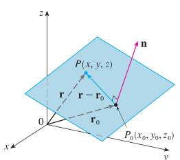
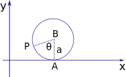
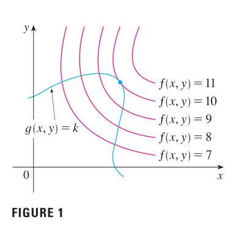

## equations of planes

- vector equation of the palne
$$
\begin{aligned}
n \cdot (r-r_{0}) = 0\\
n \cdot r = n \cdot r_{0}
\end{aligned}
$$

$$
n = \langle a, b, c \rangle, \quad r=\langle x, y, z \rangle, 
r_{0}=\langle x_{0}, y_{0}, z_{0} \rangle
$$
$$
\begin{aligned}
\langle a,b,c, \rangle \cdot \langle x-x_0, y-y_0, z-z_0 \rangle &= 0\\
a(x-x_0) + b(y-y_0) + c(z - z_0) &= 0
\end{aligned}
$$

**problem)**

Plane through origin with normal vector $\vec{N} = \langle 1,5,10 \rangle$ ?

P is in plane 

$$ \Leftrightarrow \overrightarrow{OP} \cdot \vec{N} = 0 $$

$$ \Leftrightarrow x + 5y + 10z = 0 $$

**problem)** 

plane through $P_0 (2, 1, -1)$ and $\perp \vec{N} = \langle 1, 5,10 \rangle$

P is in plane

$$ \Leftrightarrow \overrightarrow{P_{0}P} \cdot \vec {N} = 0 $$

$$\Leftrightarrow \langle x-2, y-1, z+1 \rangle \cdot \langle 1,5,10 \rangle =0 $$

$$\Leftrightarrow (x-2)+5(y-1)+10(z+1) =0$$

$$\Leftrightarrow x+5y+10z=-3 $$

In equation $ax+by+cz=d, \quad \langle a,b,c, \rangle = \text{normal vector} \vec{N}$

## equations of lines

* line

  intersection of 2 planes or trajectory of a moving point "parametric equation"

**ex)** 

line through 

$$ Q_0 = (-1, 2,2 ) $$
$$ Q_1 = (1, 3, -1) $$
$$
Q(t) = \text{moving point, at } t=0 \text{ it's at } Q_0 \text{ moves at constant speed on the line}
$$
$$
\text {What is the position at time t, } Q(t) \text{?}
$$
$$
\overrightarrow{Q_0 Q(t)} = t \overrightarrow{Q_0 Q_1} = t \langle 2,1,-3 \rangle
$$
$$
Q(t) = ( x(t), y(t), z(t))
$$

$$
x(t) + 1 = 2t \quad
y(t) -2 =t \quad
z(t) -2 = -3t
$$

$$
\begin{aligned}
\overrightarrow{Q_0 Q(t)} &= t \overrightarrow{Q_0 Q_1}\\
x(t) &= -1 + 2t\\
y(t) &= 2+ t\\
z(t) &= 2-3t\\
Q(t) &= Q_0 + t \overrightarrow{Q_0 Q_1}
\end{aligned}
$$

* cycloid

  wheel of radious a rolling on floor(x-axis)
p = a point on rim of wheel 
starts at 0. what happen?

Question: position $(x(\theta), y(\theta))$ of the point P?
as a function of the angle $\theta$ by which the wheel has rotated
 
$$
\overrightarrow{OP} = \overrightarrow{OA} + \overrightarrow{AB} + \overrightarrow{BP} \qquad
\overrightarrow{OA}=\langle a\theta, 0\rangle \qquad
\overrightarrow{OA} = \text{arclength from A to P }
$$

$$
\overrightarrow{AB}=\langle 0, a \rangle
$$

$$
\overrightarrow{BP} \langle -a \sin{\theta}, -a \cos {theta} \rangle
$$

$$
\overrightarrow{OP} = \langle a\theta - a\sin{\theta}, a - a\cos{\theta} \rangle
$$

Question: what happens near bottom?
Answer: take length unit = radius a=1

$$
\begin{aligned}
x(\theta) &= \theta - \sin{\theta}\\
y(\theta) &= 1 - \cos{\theta}\\
\sin(\theta) &\sim \theta \text{ for } \theta \text{ small}\\
\cos(\theta) &\sim 1
\end{aligned}
$$

Taylor approximation for t small 

$$
f(t) \approx f^{'} (0) + tf^{'}(0) + \frac{t^2}{2}f^{''}(0)+\frac{t^3}{6}f^{'''}(0)
$$
$$
\begin{aligned}
sin(\theta) &\approx \theta - \frac{\theta}{6} \\
\cos(\theta) &\approx 1 - \frac{\theta^2}{2}\\
x(\theta) &\approx \theta - \left (\theta - \frac{\theta}{6} \right ) \approx \frac{\theta^3}{6}\\
y(\theta) &\approx 1 - \left (1 - \frac{\theta^2}{2} \right ) \approx \frac{\theta^2}{2}
\end{aligned}
$$

x 값이 y값의 크기에 비해 훨씬 작다.

$\frac{y}{x} \approx \frac{}{} = \frac {3}{\theta} \rightarrow \infty$ when $\theta \rightarrow 0$
slope at orighin is $\infty$

## parametric equations
position of a moving point
: 
$$
F(t)=\langle x(t), y(t), z(t) \rangle
$$

ex) cycloid (wheel radius 1, at unit speed)

$$
\vec r(t) = \langle t - \sin(t), 1-\cos(t)
$$

velocity vector 
: 
$$\vec{v}=\frac{d\vec r}{dt}=\langle \frac{dx}{dt}, \frac{dy}{dt}, \frac{dz}{dt} \rangle$$

ex) for cycloid
$$
\vec{v} = \langle 1-\cos(t), \sin(t) \rangle
$$
at t=0: $\vec{v}=0$

speed (scalar)
: 
$|\vec{v}|=\sqrt{(1-\cos(t)^2+\sin^2(t)}=\sqrt{2-2\cos(t)}$

acceleration
: $\vec{a}=\frac{d\vec{v}}{dt}$

ex) cycloid $\vec{a}=\langle \sin(t), \cos(t) \rangle$ at 
t=0: $\vec{a}=\langle 0, 1 \rangle$

$$
|\frac{d\vec{r}}{dt} \ne \frac{d|\vec{r}|}{dt}
$$

arc length
: 
s=distance travelled alng trajectory

s versus t?

$$
\frac{ds}{dt} = speed = |\vec{v}|
$$

ex) length of an arch of cycloid is $\int_{0}^{2\pi}\sqrt{2-2\cos(t)dt}$

unit tangent vector
: 

$$
\hat {T} = \frac {\vec{v}}{|\vec{v}|}
$$

$$
\vec{v}=\frac{d\vec{r}}{dt}=\frac{d\vec{r}}{ds}\frac{ds}{dt}
= \hat{T} \frac{ds}{dt}
$$

velocity has direction(tangent to traj = $\hat{T}$), lenght(speed = $\frac{ds}{dt}$)

## partial derivative

partial derivative of f with respect to x at (a,b)
: 
 $$f_{x}(a,b) = g'(a) \quad \text{ where } \quad g(x)-f(x,b)$$

$$f_{x}(a,b)= \lim_{h\to \infty}\frac{f(a+h,b)-f(a,b)}{h}$$

partial_derivative of f with respect to y at (a,b)
: 
 $$f_{y}(a,b)= \lim_{h\to \infty}\frac{f(a,b+h)-f(a,b)}{h}$$

If f is a function of two variables, its partial derivatives are the functions $f_{x}$ and 
$f_{y}$ defined by

$$f_{x}(x,y)= \lim_{h\to \infty}\frac{f(x+h,y)-f(x,y)}{h}$$

$$f_{y}(x,y)= \lim_{h\to \infty}\frac{f(x,y+h)-f(x,y)}{h}$$

notiation for partial derivatives
: 
 If $z= f(f,y)$, we write
$$f_{x}(x,y)=f_{x}=\frac{\partial{f}}{\partial{x}}
=\frac{\partial}{\partial{x}}f(x,y)=\frac{\partial{z}}{\partial{x}}=f_{1}=D_{1}f=D_{x}f $$

$$f_{y}(x,y)=f_{x}=\frac{\partial{f}}{\partial{y}}
=\frac{\partial}{\partial{y}}f(x,y)=\frac{\partial{z}}{\partial{y}}=f_{2}=D_{2}f=D_{y}f $$

## Approximation formula
If we change $x \rightarrow x+\Delta{x} \quad y \rightarrow y+\Delta{y}$

$z=f(x,y)$ then $\Delta{z} \approx f_{x}\Delta{x} + f_{y}\Delta{y}$

Tangent Planes
: $f_{x} \, f_{x}$ are slopes of 2 tangent lines.

$$
\frac {\partial{f}}{\partial{x}}(x_{0}, y_{0}) = a \Rightarrow \quad
L_{1} = 
\begin{cases}
z=z_{0}+a(x-x_{0})\\
y=y_{0}
\end{cases}
$$

$$
\frac {\partial{f}}{\partial{y}}(x_{0}, y_{0}) = b \Rightarrow \quad
L_{2} = 
\begin{cases}
z=z_{0}+b(y-y_{0})\\
x=x_{0}
\end{cases}
$$

$L_{1}$, $L_{2}$ are both tangent to the graph $z=f(x,y)$

Together they determine a plane.
$$
z = z_{0}+a(x - x_{0}) + b(y-y_{0})
$$

Approximation formula says: graph of f is close to its tangent plane.

## Application of partial derivatives

Optimization problems - find min/max of a function $f(x,y)$
: At a local min or max, $f_{x}=0$ and $f_{y}=0$ 
$\Leftrightarrow$ tangent plane to graph $z=f(x,y)$ is horizontal 

critical point
: $(x_{0}, y_{0})$ is a critical point of f if $f_{x}(x_{0}, y_{0})=0$ 
and $f_{y}(x_{0}, y_{0})=0

ex) 
$$f(x,y)=x^{2}-2xy+3y^{2}+2x-2y$$
$$
f_{x}=2x-2y+2 =0
$$
$$
f_{y}=-2x+6y-2=0
$$
$$
\therefore \quad \text{critical point } (x,y) = (-1, 0)
$$
possible local min, local max, saddle.
complete the square
$$
f(x,y)=(x-y)^{2} + 2y^{2} + 2x - 2y
$$
$$
f(x,y)=((x-y) + 1)^{2} + 2y^{2} - 1 \geqslant -1 = f(-1, 0)
$$
critical point (-1, 0)  is a minimum.

Least squares interpolation
: Given experimental data $(x_{1}, y_{1}), (x_{2}, y_{2}) \dots (x_{n}, y_{n})$ 
find "best fit" line $y=ax+b$

find minimizing total squere deviation a and b.

deviation for each data point $y_{i}-(ax_{i}+b)$

Minimize $D(a,b) = \sum_{i=1}^{n}[y_{i}-(ax_{i}+b)]^{2}$

$$
\frac {\partial{D}}{\partial{a}} = \sum_{i=1}^{n} 2 (y_{i} - (ax_{i} + b)) (-x_{i}) = 0
$$
$$
\frac {\partial{D}}{\partial{b}} = \sum_{i=1}^{n} 2 (y_{i} - (ax_{i} + b)) (-1) = 0
$$

$$
\begin{cases}
\sum_{i=1}^{n} (x_{i}^{2}a + x_{i}b x_{i}y_{i}) = 0\\ 
\sum_{i=1}^{n} (x_{i}a + b - y_{i}) = 0
\end{cases}
$$
$$
\Leftrightarrow
\begin{cases}
(\sum_{i=1}^{n} x_{i}^{2})a + (\sum_{i=1}^{n}x_{i})b  = (\sum_{i=1}^{n}x_{i}y_{i})\\ 
(\sum_{i=1}^{n} x_{i})a + nb  = \sum_{i=1}^{n}y_{i}
\end{cases}
$$

2x2 linear system. solve for (a, b)

Best exponential fit 
: 
$$
y=ce^{ax} \Leftrightarrow \ln(y) = \ln(c)+ax 
$$

Best quadratic fit 
: 
$$
D(a, b, c) = \sum_{i=1}^{n}(y_{i} - (ax_{i}^{2} + bx_{i} + c))^{2}
$$

## Implicit differentiation

$$
\begin{aligned}
y &= f(x)\\
dy &= f\prime(x)dx
\end{aligned}
$$

Ex : 
$$
\begin{aligned}
y &= \sin^{-1}(x)\\
x &= \sin(y)\\
dx & = \cos(y)dy\\
\frac{dy}{dx} = \frac{1}{\cos(y)} = \frac{1}{\sqrt{1-x^{2}}}
\end{aligned}
$$

if $f(x, y, z)$
$$
\begin{aligned}
df &= f_{x}dx + f_{y}dy + f_{z}dz\\
   &= \frac{\partial f}{\partial x} dx + \frac{\partial f}{\partial y}dy + \frac{\partial f}{\partial z}dz
\end{aligned}
$$

df is not $\nabla$f

- encode how change in x, y, z affect f
- placeholder for small variations $\nabla x, \nabla y, \nabla z$ 
to get approx formula $\nabla f \approx f_{x}\nabla x + f_{y}\nabla y + f_{z}\nabla z$

- divide by something like dt to get a rate of change when x = x(t), y=y(t), z=z(t)
$$
\frac{df}{dt} = f_{x}\frac{dx}{dz} + f_{y}\frac{dy}{dt} + f_{z}{dz}{dt}
$$

## Gradient
at some point (x, y, z)
$$
\nabla{w} = < W_{x}, W_{y}, W_{z} >
$$

Theorem 
: 
$\nabla {w} \bot$ level surface; w = constant

ex)

$$
\begin{aligned}
w &= a_{1}x + a_{2}y + a_{3}z\\
\nabla {w} &= <a_{1}, a_{2}, a_{3} >;\quad a_{1} = \frac{\partial w}{\partial x}
\end{aligned}
$$

level surface
$$
a_{1}x + a_{2} + a_{3}z = c \qquad \text{pane with normal $<a_{1}, a_{2}, a_{3}>$}
$$

## directional derivatives

The directional derivative of f at $(X_{0} + y_{0})$ in the direction of 
a unit vector $u= <a,b>$ is
$$
D_{u}f(x_{0},y_{0}) = \lim_{h \to 0} \frac
{f(x_{0} + ha, y_{0} + hb) - f(x_{0}, y_{0})}{h}
$$
if this limit exists.

The partial derivatives of f with respect to x and y are just special cases of the directional derivative.

If f is a differentiable function of x and y, then 
f has a directinal derivative in the direction of any unit vector $u = <a,b>$ and
$$
D_{u}f(x,y) = f_{x}(x,y)a + f_{y}(x,y)b
$$

## LAGRANGE MULTIPLIERS

if $\nabla g(x_{0}, y_{0}, z_{0}) \neq 0$, there is a number $\lambda$ such that
$$
\nabla f(x_{0}, y_{0}, z_{0}) = \lambda \nabla g (x_{0}, y_{0}, z_{0})
$$
The number $\lambda$ is called a Lagrange multiplier.

Method of Lagrange Multipliers
: 
To find the maximum and minimum values of $f(x, y, z)$ subjet to
 the constraint $g(x, y, z) =k$ [assuming that these extreme values
 exist and $\nabla g \neq 0$ on the surface $g(x, y, z) = k$]

- Find all values of x, y, z and $\lambda$ such that
$$
\begin{aligned}
\nabla f (x, y, z) = \lambda \nabla g(x, y, z)
g(x, y, z) = k
\end{aligned}
$$
- Evaluate $f$ at all the points(x, y, z) that result from previous step.
 The largest of these values is the maximum value of $f$;
 the smallest is the minimum value of $f$.

## vector calculus

### The fundamental Theorem for line integrals

Let C be a smooth curve given by the vector function r(t),
$a \eqslantless t \eqslantless b$. Let f be a differentiable function of
two or three variables whos gradient vector $\nabla f$ is continuous on C. Then
$$
\int_{C} \nabla f \cdot dr = f(r(b)) - f(r(a))
$$

Suppose F is a vector field that is continuous on an open connected
region D. If $\int_{C}F \cdot dr$ is independent of path in D, then
F is a conservative vector field on D; that is, there exists a function f
such that \nabla f = F$.

How is it possible to determine whether or not a vector field F is conservative?
Suppose it is known that $F = P \hat i + Q \hat j$ is conservative, where P
and Q have continuous first-order partial derivatives. then there is a function
f such that $F = \nabla f$, that is,
$$
P = \frac{\partial f}{\partial x} \quad \text{and} \quad
Q = \frac{\partial f}{\partial y}
$$

therefore, by Clairaut's Theorem,
$$
\frac{\partial P}{\partial y} =
\frac{\partial^2 f}{\partial{y}\partial{x}} =
\frac{\partial^2 f}{\partial{x}\partial{y}} =
\frac{\partial{Q}}{\partial{x}}
$$

### Curl

If $F = p \hat i + Q \hat j + R \hat k$ is a vector field on $\mathbb {R}^{3}$
and the partial derivatives of P, Q and R all exist, then the curl of F is 
the vector field on $\mathbb {R}^{3}$ defined by
$$
\text{curl } F = \left ( \frac{\partial R}{\partial y} 
- \frac{\partial Q}{\partial z}\right) \hat i +
\left ( \frac{\partial P}{\partial z}
- \frac{\partial R}{\partial x}\right ) \hat j +
\left ( \frac{\partial Q}{\partial x}
- \frac{\partial P}{\partial y} \right ) \hat k
$$

define the vector differential operator $\nabla$("del") as
$$
\nabla = \hat i \frac{\partial}{\partial x} 
+ \hat j \frac{\partial}{\partial y}
+ \hat k \frac{\partial}{\partial z}
$$

$$
\nabla \times F = 
  \begin{vmatrix}
  i & j & k \\
  \frac{\partial}{\partial x}
  & \frac{\partial}{\partial y}
  & \frac{\partial}{\partial z} \\
  P & O & R
  \end{vmatrix}
$$

$$
\text{curl } F = \nabla \times F
$$

If f is a function of three variables that has continuous second-order
partial derivatives, then
$$
curl(\nabla f) = 0
$$

Since a conservative vector field is one for which $F = \nabla f$, above can
be rephrased as follows
: 
If F is conservative, then cur F = 0.

### Divergence

If $F = P \hat i + Q \hat j + R \hat k$ is a vector field on $\mathbb R^3$ and
$\partial P / \partial x$, $\partial Q / \partial y$, and $\partial R / \partial z$ exist,
then the divergence of F is the function of three variables defined by
$$
div \quad \mathbf{F} = \frac{\partial P}{\partial x}
+ \frac{\partial Q}{\partial y}
+ \frac{\partial R}{\partial z}
$$

$$
div \quad \mathbf{F} = \nabla \cdot F
$$

If $F = P \hat i + Q \hat j + R \hat k$ is a vector field on $\mathbb{R}^3$ and P, Q, and R
have continuous second-order partial derivatives, then
$$
div \quad curl \quad \mathbf{F} = 0
$$
